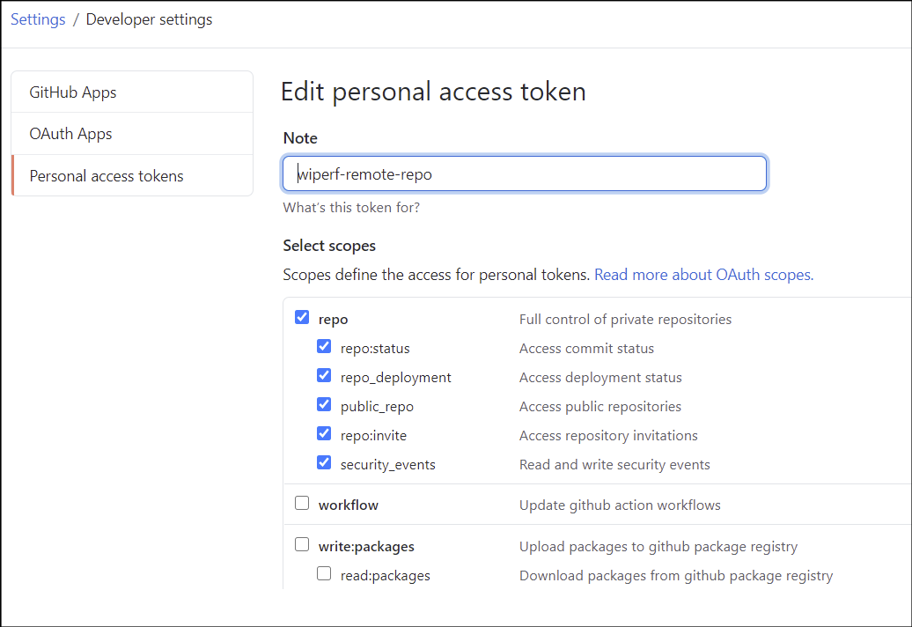

Title: Remote Configuration Server
Authors: Nigel Bowden

# Remote Configuration Server
In wiperf V2, we have added a rudimentary remote configuration server feature to allow the probe's ```config.ini``` file to be changed remotely. The feature relies on having a private repository in GutHub to store the remote configuration file(s).

To help understand how this can work for you, and to understand the limitations of the solution, here is an overview of the process:

- A private GitHub repo must be created on GitHub - it must be private, otherwise the whole world can read your config files....which is not a good thing (See [this doc](https://docs.github.com/en/github/getting-started-with-github/create-a-repo){target=_blank} for details on creating a private repo).
- An authorization token for the GitHub repo must be created to allow the probe to access it and read its config file. See [this guide](https://docs.github.com/en/github/authenticating-to-github/creating-a-personal-access-token){target=_blank} to find out how to create a personal access token.<br><br>
<div style="float: center;">

</div><br>
Note that the token must have the full `repo` section enabled to allow the the repo config files to be pulled (yeah, wouldn't you think there'd be some type of read-only attribute...). No other scopes should be enabled. <br><br>__Also, be aware that this token can access all of your private repos (which may be a issue if you have multiple private repos)__
- Each time a test cycle starts (i.e. every 5 mins), wiperf will check its local configuration file ```config.ini``` to see if a remote repository is configured
- If a remote repo is configured, then the wiperf process will check to see if it is time to check its remote config file - it doesn't check every poll cycle, to keep the network traffic overhead low. The interval is configured via the `cfg_refresh_interval` field in config.ini
- If it's time to check the config file, wiperf will pull the config file from the private GutHub repo (using its access token) and overwrite its local config file with its newly retrieved file. This will be used for the next test cycle. <br><br>(__Note__: The remote config file name can be anything you choose, it will get re-written as the local `config.ini` file on the probe once downloaded)

The section of the  ```config.ini``` file that controls remote repo usage is shown below (with sample input):

```
; central configuration server details
cfg_url: https://raw.githubusercontent.com/<your_username>/<repo_name_removed>/master/probe1.ini
cfg_username:
cfg_password:
cfg_token: 8299626c2729a034b5f7b8a1e6294951da544b47
; how often shall we pull the config (in secs)
cfg_refresh_interval: 1800
```

See the following reference guide for an explanation of each field: [config.ini reference guide](config.ini.md#cfg_url)

__Note__: Although the username and password fields are provided to allow GitHub login credentials to be used, this is generally a bad idea - go with the personal access token. Please consider all of the security implications of storing any type of credentials in local or centrally stored files

__Note__: This is an advanced configuration option that requires thorough testing before deploying your probe. Mis-configuration of your remote config file can cause significant operational issues.

__Note__: Don't forget, your probe `config.ini` file will be over-written each time the remote configuration file is pulled down. Therefore, the file pulled must contain the required access credentials to access the remote config file (i.e. you must complete the `central configuration server details` section of the remote config file)