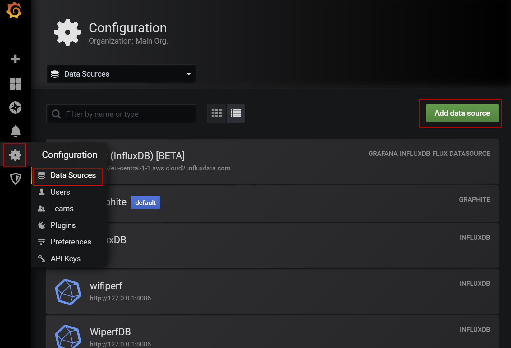
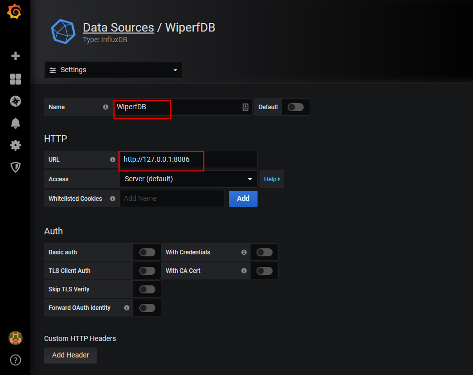
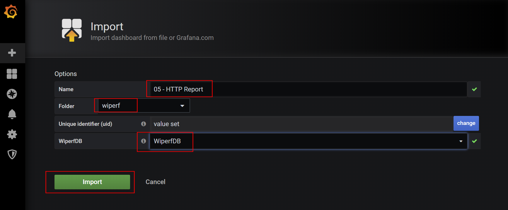

Title: Grafana Configuration
Authors: Nigel Bowden

# Grafana Configuration
<div style="float: right;">

</div>Once the Granafa installation is complete, there are two main tasks remaining:

- Integration of Grafana with InfluxDB
- Addition of the wiperf dashboards


## Integration of Grafana with InfluxDB
Integration with InfluxDB is required to allow Grafana to send data queries to the InfluxDB database and turn the data in to graphical reports. To do this, Grafana needs to know:

- the data source is an InfluxDB database
- where it is (IP address & port)
- the name of the database within Influx DB (as we previously configured)
- the access credentials to be used to pull the data out of InfluxDB

The screen-shots below show the required steps:

- __Configuration > Data Sources > Add Data Source__:



- Select __InfluxDB__:


- Enter the name to be referenced for the connection, the URL, database name, username & password (all highlighted below) - note the InfluxDB values use those configure previously when we set up InfluxDB (the datbase name, username & password settings must match those used in the InfluxDB setup):




Once completed, if you hit __'Save and Test'__, the database connection test should indicate success if all information has been correctly entered.  


## Adding Wiperf Dashboards

Dashboard xml files can be obtained from the ```/usr/share/wiperf/dashboards``` folder of the probe. These may be downloaded to your local laptop using a utlity such as SCP or SFTP. Alternatively, the dashboard files may be accessed in the main wiperf repo at :  [folder](https://github.com/wifinigel/wiperf/tree/main/dashboards){target=_blank}

Once the dashboard files have been downloaded, they may be imported to Grafana using the following steps:

- Use the menu option __Dashboards > Manage > Import__:


- Hit the __'Upload Json'__ button and select the dashboard file on your local laptop that you'd like to upload


- The name of the imported report will be shown as indicated. If you'd like to create or select a folder, this can be done in the __'Folder'__ field. The database connection previously created as the data source must also be selected to ensure the InfluxDB database can be queried: 



Once __'Import'__ is hit, the dashboard will be available in the main Grafana GUI.

To find out more about usng Grafana, visit the [Grafana getting started pages.](https://grafana.com/docs/grafana/latest/getting-started/getting-started/){target=_blank}


