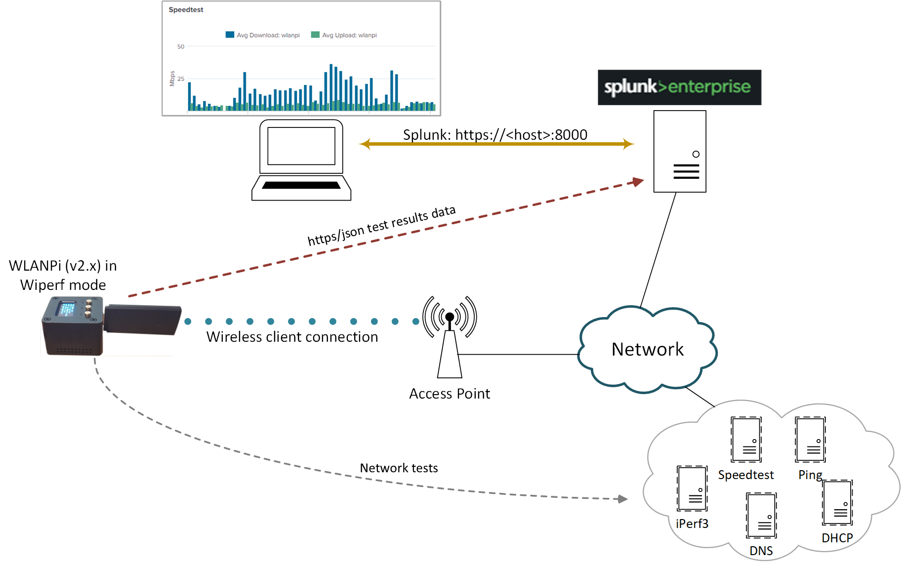
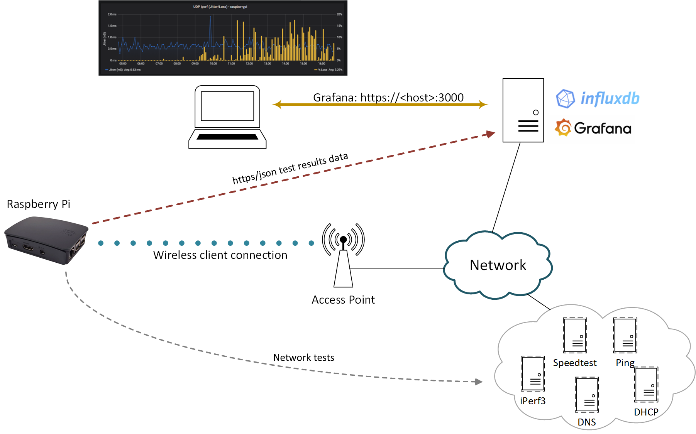

Title: Operation Overview

# Overview of Operation


Wiperf is an open source utility that runs on a Raspberry Pi or a WLAN Pi hardware device. It provides network probe functionality to gather performance data to give an indication of how a network looks from an end user perspective. 

It runs a series of tests to gather metrics on network connectivity and performance through the execution of tests such ICMP ping, DNS lookups and iperf. These are fully configurable by editing a local configuration file on the probe device at the time of deployment.

## Configuration
To configure the details of the tests to be run on a probe, a local configuration file on the probe needs to be updated. This will provide information to the probe about items such as the required network connectivity (e.g. wireless/ethernet),  IP and credential information for the data server and test details.

The configuration file can be updated by accessing the CLI of the probe (usually via SSH) and editing the file ```/etc/wiperf/config.ini```. 

In addition, configuration of a number of other Linux-OS files (e.g. `/etc/network/interfaces`) is also required to connect the probed to the network under test, and run wiperf tests on a regular basis. More details about the probe configuration can be found on [this page](probe_configure.md).

## Logging
Following the completion of the configuration steps, wiperf will run every 5 minutes, performing the configured network tests and sending results data to a reporting server.

A number of logs are generated to provide support information about the status and operation of the wiperf process. For more information about the logs created, please visit our [troubleshooting page](troubleshooting.md#logging).

## Reporting
Gathering the data with a probe is only half of the story when using wiperf. The gathered data must be sent to a data collection server to allow it to be visualized to allow analysis of network performance. The data server must be an instance of either:

- Splunk, or
- InfluxDB with Grafana  

### Splunk



The graphic above outlines the collection of network performance data and how this is sent to Splunk by the wiperf probe. The Splunk instance may be provided anywhere that is convenient (e.g. on a server locally, via VPN, cloud etc.)

In summary, the steps for data collection are as follows:

1. A wiperf probe (i.e. a WLAN Pi or Raspberry Pi) is configured to perform tests and send results to a Splunk server
2. The probe performs the configured tests (e.g. speedtest, iperf, http etc.)
3. The results of each test are sent over https to the Splunk server for storage and later analysis
4. The data is analyzed by accessing the dashboard (a web GUI) of the Splunk server with a browser

(*Note that the Splunk server acts as both the data repository and reporting platform for collected data*)

### Grafana/Influx 



The graphic above outlines the collection of network performance data and how this is sent to Influx & Grafana by the wiperf probe. 

Grafana is a popular open-source data visualization tool. It is used to graph the performance data collected by wiperf. However, Grafana needs a data source from which to pull its network performance data. To meet this requirement, a InfluxDB database server is used. Like Grafana, InfluxDB is also an open-source package. (*Note that this setup contrasts with using Splunk, which allows us to use the same package to provide both the data storage and analysis/visualization functions*)

For small-scale instances, Grafana & Influx may be installed on the same server platform and Grafana configured to use the local instance of InfluxDB as its data source.

Grafana & Influx may be provided anywhere that is convenient (e.g. on a server locally, via VPN, cloud etc.). Note that wiperf only needs to be able to send data to InfluxDB - it requires no communication with the Grafana instance.

In summary, the steps for data collection are as follows:

1. A wiperf probe (i.e. a WLAN Pi or Raspberry Pi) is configured to perform tests and send results to an InfluxDB server
2. The probe performs the configured tests (e.g. speedtest, iperf, http etc.)
3. The results of each test are sent over https to the InfluxDB server for storage
4. Grafana is configured to use InfluxDB as its data source to allow visualization of performance data
5. Data is analysed by accessing the dashboard (a web GUI) of the Grafana server, which pulls the required dashboard data from InfluxDB.

