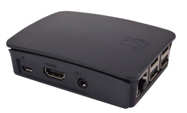

Title: Probe Platform
Authors: Nigel Bowden

# Probe Platform

Wiperf has been primarily designed to work on the NEO2 version of the WLAN Pi platform and the Raspberry Pi platforms.

## WLAN Pi

Wiperf is baked in to the image of the WLAN Pi. It can be activated by switching in to wiperf mode on the WLAN Pi. Find out more details at the official documentation site for the WLAN Pi: [https://wlan-pi.github.io/wlanpi-documentation/](https://wlan-pi.github.io/wlanpi-documentation/){target=_blank}

## Raspberry Pi

Wiperf on the RPi has been tested on models that have an internal Wi-Fi NIC: 3b+, 3a+ and 4. It will likely work on most that have an internal NIC, but I don't have the resources or time to try them all. 

Earlier versions of the RPi that do not have a an internal NIC will need some type of USB wireless adapter, but as support for external wireless NICs is very poor and many tend to be 2.4GHz only, I've not explored this area in detail. 

Unfortunately, getting a 2 stream 802.11ac NIC going seems very difficult due to the lack of drivers available, so the internal, single stream NIC is often best we can generally do. However, the situation does seem to be improving with more recent kernels, so test out a few NICs and see how you do. 

Using a single stream NIC has its limitations as speed performance is very limited, but as the main aim of wiperf is to monitor user experience (particularly changes in that experience), then it's good enough for many use-cases where we are mainly interested in changes in relation to the usual baseline.

__Note: __*Please use an RPi platform that is used only as a dedicated wiperf probe. Please do not install additional packages other than those recommended. Also, please use only one active Ethernet interface and one active wireless interface (as shown in the notes on this site). Multiple additional live adapters will likely cause operational issues.* 

## Other Platforms

In essence, wiperf is a series of python scripts & modules, together with a few supporting bash scripts to glue a few things together. It will likely work on other Debian-type systems, so it's worth giving it a go on other systems if you fancy tinkering around on another platform. When using the install script, install using the 'rpi' option. Let me know if you get it going on other platforms, as it will be interesting to share your experiences.
