Title: Splunk Configuration
Authors: Nigel Bowden

# Splunk Configuration
<div style="float: right;"></div>Now that we have a Splunk server setup, we need to customize it to report our probe data. The steps required are all via the Splunk web GUI and are the same for all OS flavours.

## Configure Data Input To Splunk
We need to tell Splunk how we’ll be sending the data from our probe in to Splunk. We need to configure a data input that will prepare Splunk to receive the data, and to generate an authorization key to be used by the probe when sending its results data.

### Log In To Splunk
The first step is to login to Splunk using the credentials created during the Splunk install. The URL to use is:

```
    http://<Splunk_server_IP>:8000
```

### Configure  HTTP Event Collector Global Options
After login, the following page will be seen:

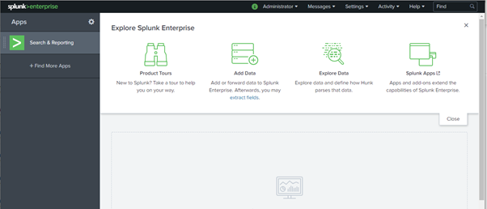

Follow the “Settings > Data > Data Inputs” menu options :

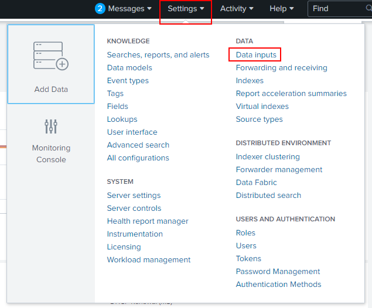

Click on the HTTP Event Collector link in the Data Inputs page shown:


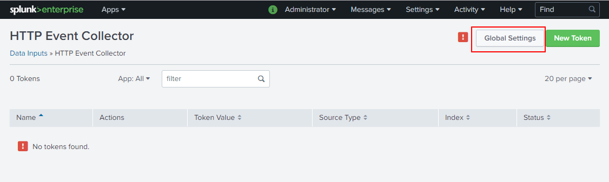


Click on the “Global Settings”  button as indicated in the graphic above to reveal the global configuration panel for the HTTP Event Collector:

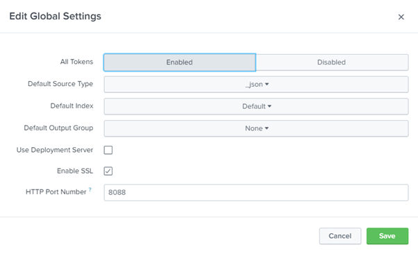

Ensure the panel is configured to look like the example shown above. This should require the following steps:

- __Make sure you hit the All Tokens > Enabled button__ (this is disabled by default which stops everything working)
- Default Source Type: Structured > _json
- Hit:  Save to take you back to the HTTP Event Collector page 

###Create a HEC Token
After returning to the  HTTP Event Collector page, hit the __New Token__ button. This will start a token creation wizard.

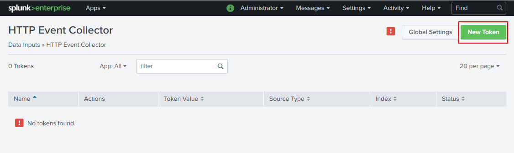

Enter a name for the token (probe HEC Token) then hit __Next__ >  :

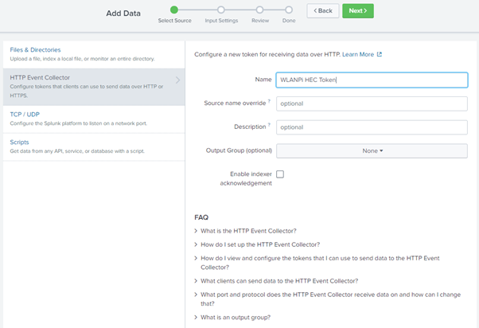

In the next wizard panel select Source type: __Select > Structured > _json__ :


Scroll down to the indexes and make the following selections:

- Select Allowed Indexes > __add all__
- Default Index : __main__

Next, hit the __Review__ >  button:

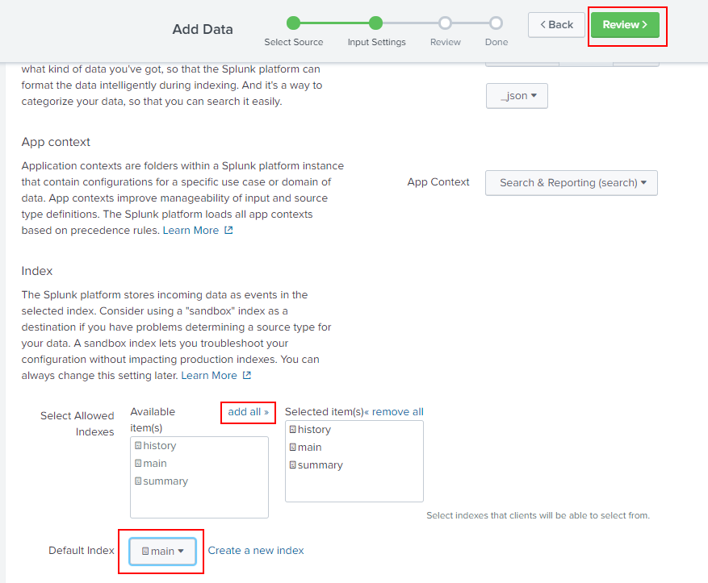

The token review panel is now should and should look like the graphic below. Finally hit the  __Submit>__  button:


A final confirmation message will be provided as shown below:

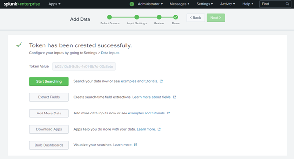

If you return to __Settings > Data Input > HTTPS Event Collector__, you will now see the token your probe will need to communicate with the Splunk server:

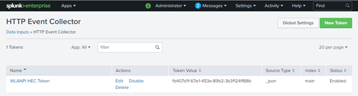

At this point, the Splunk server is ready to receive data from the probe. Ensure that your probe has been configured with the correct server IP address, port number and the token we have just created above (copy and paste the “Token Value” in to your probe config.ini file). 

If using the WLAN Pi, ensure that it is flipped in to wiperf mode. On the RPI, ensure that the required cron job has been configured to start polling.  

### Perform a Test Search
After a few minutes, when the probe has run a test cycle, data should start to appear in Splunk. The quickest way to check is to do a general search for data in Splunk and see what is being received. Go to __“Apps : Search & Reporting > Search & Reporting”__ (top menu bar) and enter a “*” in the __“New Search”__ text box. Results data should be seen as shown below:


If your search result looks like this (no results found message), then you need to wait a little longer for data to arrive, or there is likely a comms problem between your probe and Splunk:

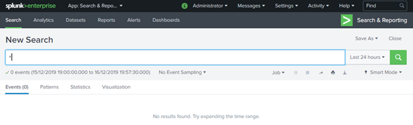

## Create a Dashboard
Now that we have data arriving at our Splunk server, we need to view the data in an interesting format. Splunk allows us to create reporting dashboards to visualize our data. We will now create a simple dashboard to demonstrate the visualization capabilities.

In the probe’s ```/usr/share/wiperf/dashboards``` directory, a number of pre-canned dashboard files have been provided to allow a simple copy & paste operation to create a dashboard. These files are also available on the GitHub page of the wiperf project:

- [https://github.com/wifinigel/wiperf/tree/main/dashboards](https://github.com/wifinigel/wiperf/tree/main/dashboards){target=_blank}

Use an SFTP client to pull the __“01 - probe_summary.xml”__ file from your probe, or open the file on the GitHub page and select “Raw” to copy and paste the code in to a local file on your laptop.

In the Splunk GUI, go to __“Apps : Search & Reporting >   Search & Reporting”__ (top menu bar) and hit the __“Dashboards”__ link:

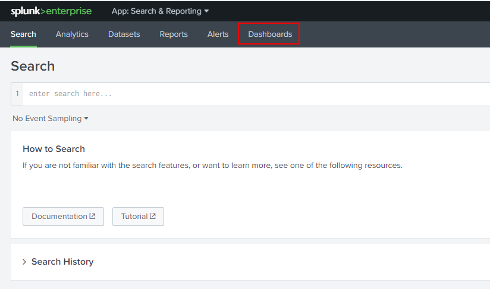

Hit the __"Create New Dashboard"__ button:


In the pop-up panel, enter a dashboard name and hit the __"Create Dashboard"__  button:

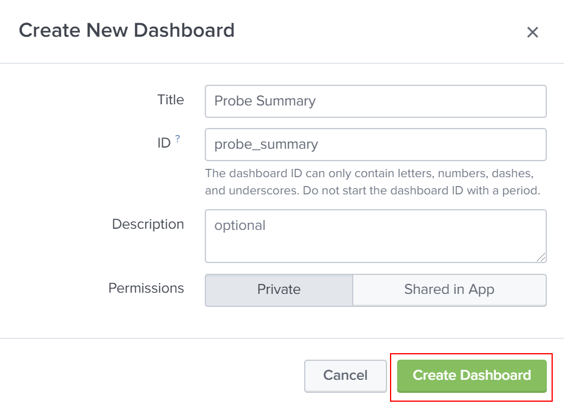

In the __“Edit Dashboard”__ panel that opens, hit the __“Source”__ button:


By default, some basic XML configuration will exist in the dashboard definition:


Open up the dashboard definition file previously downloaded from your probe or the GitHub site in a text editor. Then simply paste in the code as shown below (make sure the original code was all removed):


After hitting the  __Save__  button, the dashboard will now be shown:

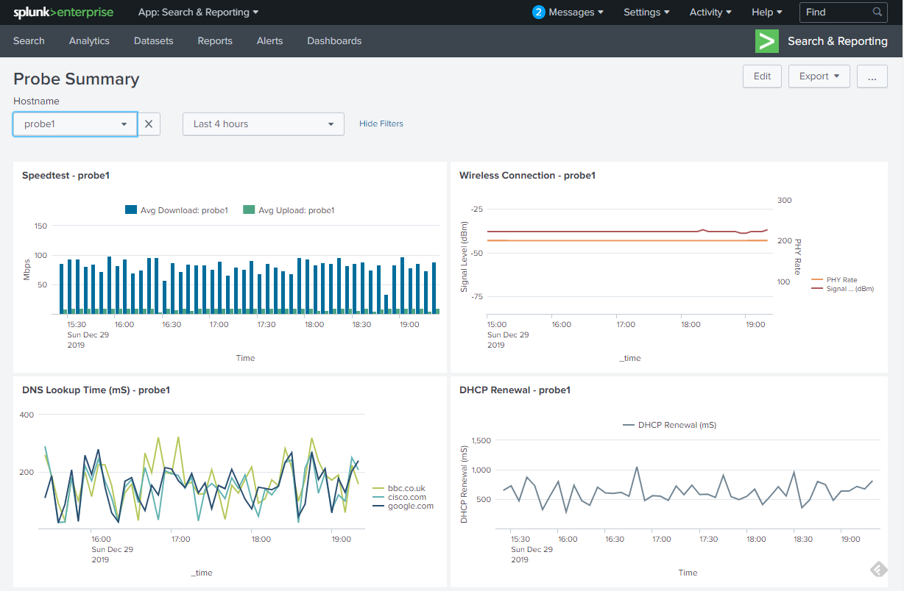

Using the hostname and time period selector above the graphs, different probes and reporting periods may be viewed.

The process above may be repeated using each of the xml files found in the dashboards folder to create a series of separate dashboards that focus on different aspects of data available using wiperf. 
