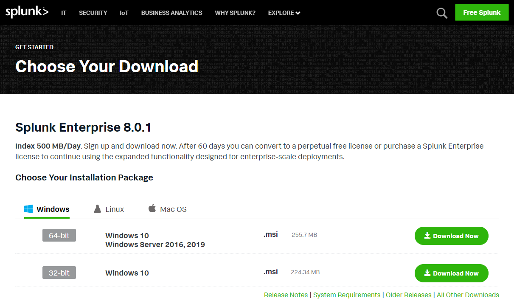

Title: Splunk Software
Authors: Nigel Bowden

# Splunk Software

To obtain the Splunk software for your data server, get along to the Splunk web site and sign up for an account if you don’t already have one: [https://www.splunk.com/en_us/download/splunk-enterprise.html](https://www.splunk.com/en_us/download/splunk-enterprise.html)

Once you’re logged in to the Splunk site, you’ll have a number of OS options, so go ahead and choose your OS option ([supported platforms can be viewed here](https://docs.splunk.com/Documentation/Splunk/latest/Installation/Systemrequirements)). There are options for Windows, Linux & Mac OS:

Once you've hit the download button, the Splunk Enterprise software chosen will start to download to your local machine, ready for installation.

It’s worth checking the download page to see if there are further download options. If you check the graphic below, you can see there is a “Download via Command Line (wget)” option, which is a much easier way to get the code directly on to your server. The options you will see here will vary between OS selections:

